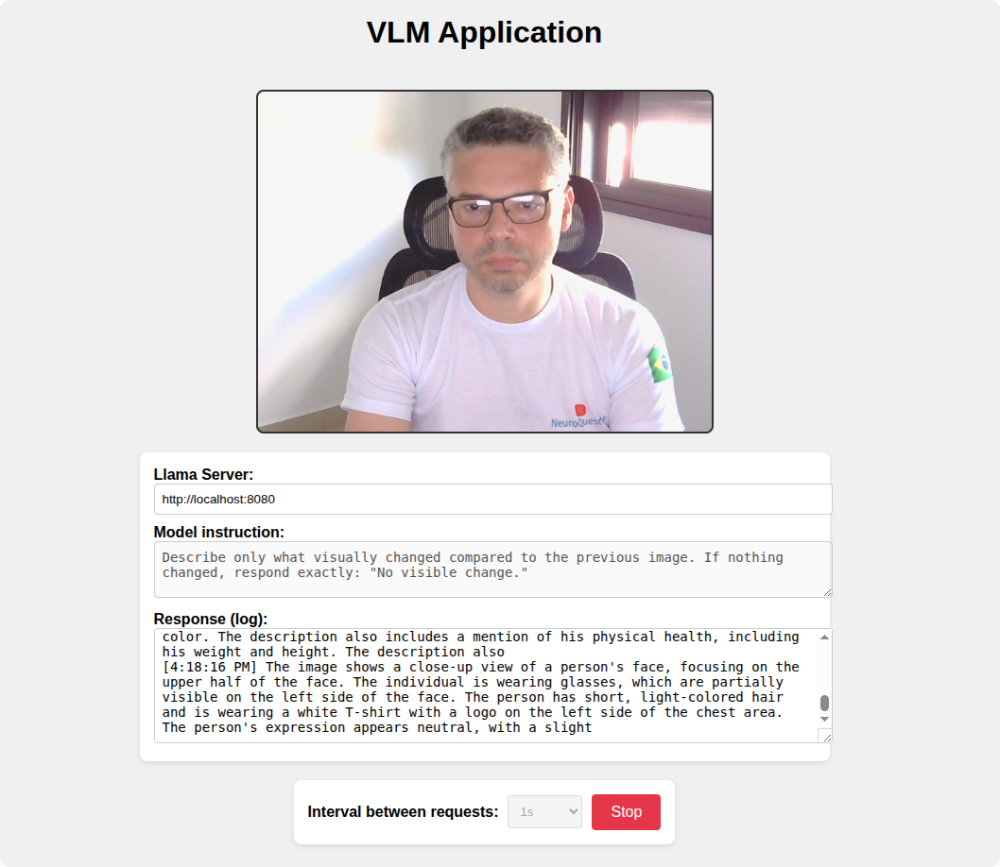

# VLM Application

Simple experiments using the [SmolVLM](https://huggingface.co/blog/smolvlm) model running locally via a [llama.cpp](https://github.com/ggml-org/llama.cpp) server. The project leverages the **SmolVLM 500M** model 
for real-time object detection and multimodal inference. 🚀👁️



## Setup & Usage

1. **Install `llama.cpp`**  
   Follow the official instructions to install and build [llama.cpp](https://github.com/ggml-org/llama.cpp).

   > 🐧 **Ubuntu users:** You can verify and follow a step-by-step installation guide here:  
   > [Running local LLMs on Ubuntu with NVIDIA GPU using llama.cpp](https://medium.com/@ecorbari/running-local-llms-on-ubuntu-with-nvidia-gpu-using-llama-cpp-2ec2e010c040)

2. **Start the llama.cpp server with SmolVLM**
   ```bash
   llama-server -hf ggml-org/SmolVLM-500M-Instruct-GGUF
   ```

💡 Tip: You may need to add *-ngl 99* to enable GPU acceleration (NVIDIA), if available.

### Advanced setup

```bash
llama-server \
  --model ~/.cache/llama.cpp/ggml-org_SmolVLM-500M-Instruct-GGUF_SmolVLM-500M-Instruct-Q8_0.gguf \
  --mmproj ~/.cache/llama.cpp/ggml-org_SmolVLM-500M-Instruct-GGUF_mmproj-SmolVLM-500M-Instruct-Q8_0.gguf \
  --gpu-layers -1 \
  --ctx-size 4096
```  

